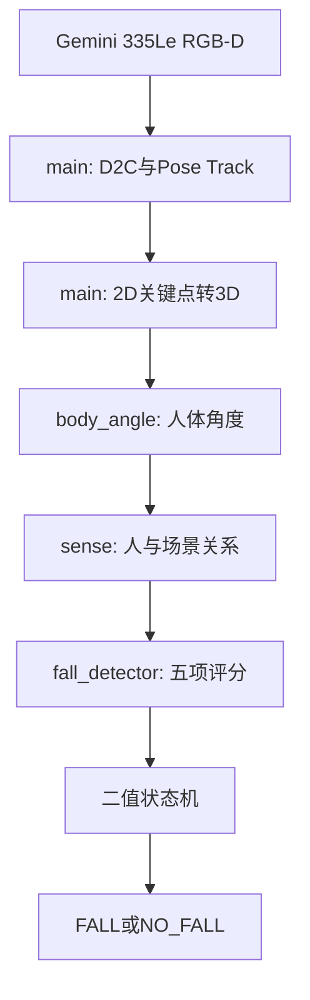

# 跌倒检测代码框架

## 1. 完整数据流



地面平面由 `ground_detector.py` 单独标定并写入 `ground.yaml`。运行中所有可调
阈值、权重、模型、相机超时和显示选项集中在 `config.yaml`。

## 2. 文件职责

| 文件 | 唯一职责 | 独立执行时 |
|---|---|---|
| `ground_detector.py` | 打开相机完成地面标定 | 显示地面点云/拟合结果并生成 `ground.yaml` |
| `config.yaml` | 管理在线流程全部可调参数 | 不执行 |
| `body_angle.py` | 根据3D关键点和地面法向量计算、滤波人体角度 | 打开相机，只显示角度层结果 |
| `sense.py` | 判断人与床、沙发、椅子和地面的关系 | 打开相机，显示家具框和关系 |
| `fall_detector.py` | 五项评分和只输出 `FALL/NO_FALL` 的二值状态机 | 打开相机，显示各项分数和结果 |
| `main.py` | 统一相机采集、数据转换、模块编排和总画面 | 执行完整流程 |
| `get_intrinsics.py` | 相机内参诊断辅助工具，不参与在线流程 | 打印/检查当前相机参数 |

模块算法不各自复制相机SDK代码。三个模块直接执行时，通过 `main.py` 的公共
相机测试入口采集数据，再只显示到各自功能层为止。因此，独立测试和完整流程
使用完全相同的D2C、Pose、3D反投影与质量门控代码。

## 3. 模块接口

### body_angle.py

输入：`person_id`、17个3D关键点、关键点置信度、地面平面。

输出：原始角度、滤波角度、测量模式、人体方向向量、测量质量和失败原因。

角度定义：`0°`接近竖直，`90°`接近水平。优先使用肩中心到髋中心；肩部
缺失时按配置回退为髋到膝或髋到踝。

### sense.py

输入：人框、人体3D关键点、人体角度、家具检测框、D2C深度和RGB内参。

输出：`lying_on_bed`、`lying_on_sofa`、`sitting_on_chair`、
`standing_near_*`、`lying_on_floor` 或 `unknown`，以及置信度和几何证据。

### fall_detector.py

输入：人体角度、人框宽高比、髋高、躯干3D中心、场景和数据质量。

评分：姿态、髋高、下降速度、异常后静止、场景五项加权得到 `FallScore`。

状态机对外只有：

- `NO_FALL`：未确认跌倒；
- `FALL`：证据持续达到确认条件，恢复条件持续满足后返回 `NO_FALL`。

候选计时、瞬态证据保持和恢复计时均为内部变量，不输出其他业务状态。

## 4. 测试命令

无相机合成测试：

```bash
python3 body_angle.py --self-test
python3 sense.py --self-test
python3 fall_detector.py --self-test
python3 main.py --self-test
```

真实相机可视化测试：

```bash
python3 body_angle.py
python3 sense.py
python3 fall_detector.py
python3 main.py
```

所有相机窗口按 `Esc` 退出。若相机安装位置、俯仰角、RGB分辨率或内参发生
变化，先重新运行 `python3 ground_detector.py`，再运行其他模块。

## 5. 主流程质量门控

只有稳定 Track ID、有效躯干深度、有效3D关键点数量、工作距离和综合数据质量
全部通过时，测量才进入跌倒状态机。没有稳定ID的观测仍可显示，但不会累计
角度、场景或跌倒历史；离开画面超过配置时间的ID会在三个模块中同步清理。
