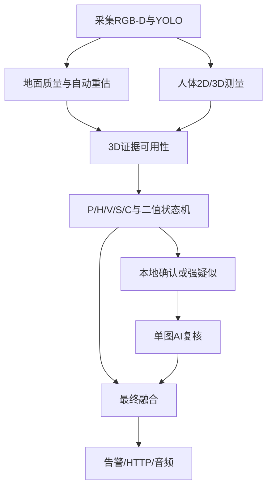
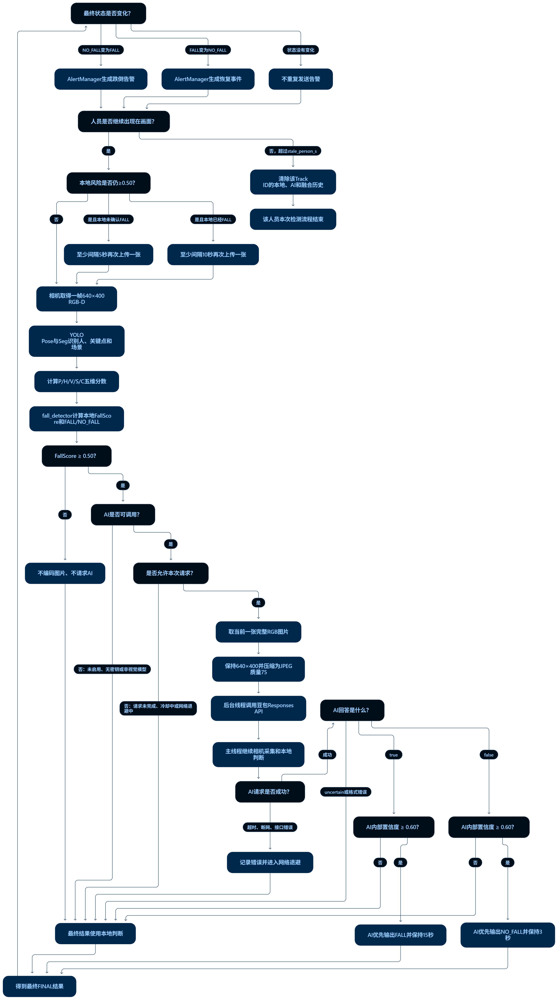

# 跌倒检测新版项目结构、本地判断与AI复核逻辑

## 1. 先理解“五维、六个特征文件”

最终跌倒评分只有五个维度：

| 维度 | 含义 | 特征文件 | 输出分数 |
|---|---|---|---|
| 姿态 | 人体是否由竖直变成水平 | `pose_3D.py`、`pose_2D.py` | `P` |
| 高度 | 髋部是否下降或接近地面 | `height.py` | `H` |
| 速度 | 髋部是否快速向下运动 | `velocity.py` | `V` |
| 静止 | 异常后是否长时间不动 | `static.py` | `S` |
| 场景 | 人是在地面还是正常躺在家具上 | `scene.py` | `C` |

这里是五个维度、六个特征文件，因为姿态维度被真正拆成了两个独立模块：

- `pose_3D.py`只计算三维角度和`P3D`。
- `pose_2D.py`只计算二维角度、人框比例和`P2D`。
- `fuse_pose_dimension()`只融合已经算好的`P3D/P2D`，不重新计算角度。

## 2. v0.95完整数据流



程序的实际执行顺序是：

1. `main.py`获取RGB和Depth，并把Depth对齐到RGB画面。
2. YOLO26 Pose检测人体框、17个关键点并维持Track ID。
3. YOLO26 Seg检测床、沙发、椅子的实例Mask。
4. `ground_manager.py`从排除人体和家具后的Depth检查地面质量，必要时自动重估。
5. `main.py`把2D关键点结合Depth反投影为3D关键点。
6. `measurement_guard.py`检查人体3D几何，并检测2D/3D姿态持续冲突。
7. 地面和人体几何可靠时计算`P3D、H、V、S、C`，否则保留`P2D`降级路径。
8. `fall_detector.py`加权有效的`P/H/V/S/C`，只输出`FALL`或`NO_FALL`。
9. 本地已确认FALL或多证据强疑似时，`ai_verifier.py`按事件异步上传一张RGB图片。
10. `decision_fusion.py`优先采用明确AI回答，AI不可用时使用本地结果。
11. 最终状态变化由`alert_manager.py`发给音频和HTTP等处理器。
### 完整流程图



### 关键条件汇总

| 阶段              | 判断条件                      | 处理结果             |
| --------------- | ------------------------- | ---------------- |
| 本地确认触发AI | `label=FALL`且分数、姿态、质量达标 | 立即准备一张图片 |
| 强疑似触发AI | P2D水平，且下降/速度/地面关系/本地分至少一项支持，连续4帧 | 防止本地漏报 |
| 地面失效兜底 | 地面无效，P2D和降级总分达到更严格阈值 | 仍可请求AI |
| 一次风险事件 | 相同触发原因只提交一次 | 防止每5秒反复收费 |
| 图片数量            | 每次1张                      | 当前完整RGB画面        |
| 图片尺寸            | 原始画面`640×400`             | 不放大、不缩小          |
| 图片压缩            | `jpeg_quality: 75`        | 减少上传大小           |
| AI并发            | `max_pending_requests: 1` | 前一个请求未结束时不再提交    |
| 事件升级 | 强疑似上传后本地正式确认FALL | 允许再提交一次 |
| AI超时            | 默认10秒                     | 放弃本次AI，使用本地结果    |
| 第一次网络退避         | 3秒                        | 暂停提交新AI请求        |
| 连续网络失败          | 3、6、12、24、48、60秒          | 最长退避60秒          |
| AI回答`true`      | 明确有效                      | 最终输出FALL，保持15秒   |
| AI回答`false`     | 明确有效                      | 最终输出NO_FALL，保持3秒 |
| AI回答`uncertain` | 证据不足                      | 使用本地结果           |
| AI调用失败          | 断网、超时、模型错误                | 使用本地结果           |
| 人员离场            | 超过`stale_person_s`，默认5秒   | 清除该ID全部历史        |

最终优先级是：

```text
后续语音/人工确认
        ↓
有效的视觉AI回答
        ↓
本地P/H/V/S/C状态机
```


## 3. 每个文件到底负责什么

| 文件 | 输入 | 判断内容 | 输出 |
|---|---|---|---|
| `ground_detector.py` | RGB-D相机数据 | 拟合地面平面 | `ground.yaml` |
| `ground_manager.py` | D2C Depth、人体框和家具Mask | 地面质量、在线重估和预热 | `GroundEstimate` |
| `measurement_guard.py` | 2D/3D角度和人体3D关键点 | 深度几何与姿态冲突保护 | `MeasurementGuardResult` |
| `pose_3D.py` | 3D关键点、关键点置信度、地面平面 | 3D人体方向 | `Pose3DResult`和`P3D` |
| `pose_2D.py` | 2D关键点、关键点置信度、人体框 | 2D人体方向和框形状 | `Pose2DResult`和`P2D` |
| `height.py` | Track ID、时间、髋部离地高度 | 高度下降和绝对低高度 | `HeightScoreResult`和`H` |
| `velocity.py` | Track ID、时间、髋部离地高度 | 向下速度 | `VelocityScoreResult`和`V` |
| `static.py` | Track ID、时间、躯干3D中心、`P/H` | 异常后的静止时间 | `StaticScoreResult`和`S` |
| `scene.py` | 人体几何、3D角度、家具Mask和Depth | 人与家具/地面的关系 | `SceneRelationResult`和`C` |
| `fall_detector.py` | `P/H/V/S/C`和恢复所需测量 | 总分、确认和恢复 | `FallDecision` |
| `ai_verifier.py` | 本地触发分数和当前一张JPEG | Responses API、后台请求、回答解析和断网退避 | `AIVerificationResult` |
| `decision_fusion.py` | 本地、视觉AI及预留外部确认 | AI优先、断网本地降级和正负结果保持 | `FusionDecision` |
| `alert_manager.py` | 最终融合结果 | 检测状态变化并调用告警处理器 | `AlertEvent` |
| `main.py` | 配置、相机和模型 | 组织完整调用顺序和显示 | 实时窗口 |
| `config.yaml` | 人工设置 | 集中保存所有可调参数 | 配置字典 |

`main.py`只负责组织流程，不在主循环中复制各维度的内部判断公式。

## 4. 公共基础数据怎么得到

### 4.1 2D关键点

YOLO26 Pose输出COCO格式17个关键点。系统主要使用：

- 左肩`5`、右肩`6`。
- 左髋`11`、右髋`12`。
- 左膝`13`、右膝`14`。
- 左踝`15`、右踝`16`。

每个关键点同时带有置信度。低于配置阈值的点不参与计算。

### 4.2 3D关键点

`main.py`在关键点周围的Depth小窗口内取有效深度中值，再使用RGB相机内参反投影：

```text
X = (u - cx) × Z / fx
Y = (v - cy) × Z / fy
Z = depth
```

输出单位是米。没有可靠Depth的关键点使用`NaN`表示，不使用0米冒充真实坐标。

### 4.3 髋高、躯干中心和数据质量

- `hip_height_m`：髋中心到地面平面的距离。
- `torso_center_3d`：有效肩点和髋点的3D平均中心。
- `data_quality`：Pose置信度、2D覆盖率、3D覆盖率、躯干完整度、人体框大小和距离的加权质量。

`data_quality`只表示RGB-D综合测量是否可信，不是跌倒概率。没有稳定Track ID时不能维护时序状态；Depth缺失、距离过远或3D质量太低时，3D维度会标为无效，但主流程仍可使用独立的`pose_2d_quality`和P2D更新降级状态机。

## 5. 姿态维度P

### 5.1 `pose_3D.py`：独立计算P3D

`pose_3D.py`优先使用双肩中心到双髋中心作为3D人体轴线：

```text
shoulder3D = (left_shoulder3D + right_shoulder3D) / 2
hip3D = (left_hip3D + right_hip3D) / 2
body_vector3D = hip3D - shoulder3D
angle3D = arccos(|body_vector3D · ground_normal| / |body_vector3D|)
```

角度含义：

- `angle3D=0°`：人体轴线平行地面法向量，接近竖直。
- `angle3D=90°`：人体轴线平行地面，接近水平。

关键保护：

- 双肩和双髋都有效时使用`FULL_BODY`模式。
- 肩部缺失时，可回退到“髋中心→膝中心”或“髋中心→踝中心”。
- 左右成对3D点必须同时有效，避免单侧深度错误改变三维方向。
- 人体轴线短于`min_vector_length_m`时，本帧无效。
- 同一Track ID、同一测量模式保存多帧角度并取中值，减少Depth抖动。

P3D评分：

```text
angle3D ≤ 30°  -> P3D = 0
angle3D ≥ 60°  -> P3D = 1
30°到60°       -> 线性增加
```

`Pose3DResult`同时输出原始角度、滤波角度、`P3D`、测量模式和测量质量。它完全不读取2D画面角度和人体框比例。

### 5.2 `pose_2D.py`：独立计算P2D

二维人体轴线来自RGB画面的肩中心和髋中心：

```text
shoulder2D = 可信肩点的平均值
hip2D = 可信髋点的平均值
dx, dy = hip2D - shoulder2D
angle2D = atan2(|dy|, |dx|)
```

角度含义与3D角度相反：

- `angle2D=90°`：人体线垂直画面x轴，通常接近站立。
- `angle2D=0°`：人体线平行画面x轴，通常接近躺卧。

二维角度子分：

```text
angle2D ≥ 60°  -> 二维角度分 = 0
angle2D ≤ 30°  -> 二维角度分 = 1
30°到60°       -> 线性降低
```

人框形状子分：

```text
bbox_ratio = 人体框宽度 / 人体框高度
bbox_ratio ≤ 0.50 -> 人框分 = 0
bbox_ratio ≥ 0.90 -> 人框分 = 1
```

站立时人体框通常高而窄，宽高比较小；躺卧时人体框通常宽而矮，宽高比较大。人框只能作为辅助证据，因为蹲下、弯腰、画面裁切也会改变宽高比。

P2D评分：

```text
P2D = 0.636364 × 二维角度分 + 0.363636 × 人框分
```

如果二维关键点不足，二维角度项不参与，本帧`P2D`只使用人框分并重新归一化。`pose_2D.py`完全不读取Depth、`ground.yaml`或三维角度。

### 5.3 P3D和P2D怎样变成P

两个模块先各算各的，再调用独立融合函数：

```text
P = 0.45 × P3D + 0.55 × P2D
```

展开后等价于原始比例：

```text
P = 0.45 × 三维角度分 + 0.35 × 二维角度分 + 0.20 × 人框分
```

如果3D深度缺失，`P3D`不作为0分参与，而是从本帧权重中移除，此时`P=P2D`。这样不会把“3D测不到”错误理解为“3D姿态正常”，但最终报警仍受`data_quality`限制。

## 6. 高度维度H：`height.py`

高度维度同时看两件事：相对过去下降了多少，以及现在是否已经很低。

```text
baseline = 最近3秒内且至少早0.3秒的最高髋高
drop = baseline - current_hip_height
H = max(drop_score, low_height_score)
```

下降量评分：

```text
drop ≤ 0.15 m -> drop_score = 0
drop ≥ 0.50 m -> drop_score = 1
```

绝对高度评分：

```text
hip_height ≥ 0.55 m -> low_height_score = 0
hip_height ≤ 0.25 m -> low_height_score = 1
```

最终取两项最大值，因此可以处理两种情况：

- 摄像头看到完整过程：从站立高度快速降到低处，下降量分很高。
- 人进入画面时已经躺下：没有历史基准，但绝对低高度分仍然有效。

髋高无效时返回`valid=False`，不会把错误高度写进历史。

## 7. 速度维度V：`velocity.py`

速度模块只判断髋部是否快速向下：

```text
vertical_velocity = (current_height - old_height) / dt
downward_speed = max(0, -vertical_velocity)
```

- `vertical_velocity<0`表示向下。
- `vertical_velocity>0`表示向上。
- 第一帧没有历史高度，因此`valid=False、V=0`，属于正常保护。
- 默认在最近`0.35 s`内选择时间间隔不少于`0.15 s`的旧高度。
- 原始速度使用指数平滑，避免单帧Depth跳变直接产生满分。

V评分：

```text
downward_speed ≤ 0.30 m/s -> V = 0
downward_speed ≥ 0.80 m/s -> V = 1
```

向上起身不会产生额外速度风险，因为`downward_speed`只保留向下分量。

## 8. 静止维度S：`static.py`

正常站立、坐着看电视也可能长时间不动，因此不能单独因为“静止”就报警。系统必须先发现姿态或高度异常：

```text
candidate = P ≥ 0.50 或 H ≥ 0.50
torso_speed = |current_torso3D - old_torso3D| / dt
```

只有`candidate=True`且躯干速度不超过`0.12 m/s`时才累计异常静止时间：

```text
静止时间 ≤ 1 s -> S = 0
静止时间 ≥ 3 s -> S = 1
```

以下任一情况会清空静止计时：

- `P`和`H`都恢复正常。
- 躯干移动速度超过阈值。
- 躯干3D中心无效。
- Track ID离开画面并被清理。

## 9. 场景维度C：`scene.py`

### 9.1 Seg Mask到底做什么

YOLO26-Seg Mask只用于确定“哪些像素属于某一个家具实例”，不是直接通过Mask重合就判断人在床上。处理过程是：

1. Seg识别床、沙发和椅子的框、类别、置信度和实例Mask。
2. 在家具框的承载面区域内与Mask取交集，例如只选择可能属于床面的区域。
3. 在交集像素中采样已经D2C对齐的Depth。
4. 把采样像素反投影成家具3D点。
5. 用这些3D点估计家具中心和承载面离地高度。

Mask太小、Mask尺寸与Depth不一致、有效深度点不足时，该家具几何无效，不参与关系判断。

### 9.2 人与家具的三个关系证据

对每个人和每件家具分别计算：

| 证据 | 含义 | 作用 |
|---|---|---|
| 2D IoU | 人框和家具框在画面中的重叠程度 | 辅助判断视觉接触 |
| 3D最近距离 | 人体肩/髋3D点到家具3D点的最小距离 | 判断空间中是否真的靠近 |
| 高度差 | 人体髋高与家具承载面高度之差 | 判断髋部是否位于床面、座面附近 |

关系置信度为：

```text
relation_confidence = 0.35 × IoU分 + 0.35 × 3D距离分 + 0.30 × 高度一致分
relation_confidence *= 家具Seg置信度
```

所以Mask重合度不是最终结论；即使画面看起来重叠，如果3D距离或高度明显不一致，也不会得到高可信家具关系。

### 9.3 关系分类

- `lying_on_bed/sofa`：3D人体角度接近水平、人与床/沙发有接触证据、髋高与承载面高度一致。
- `sitting_on_bed/sofa/chair`：人体躯干接近竖直、存在接触证据、髋高与承载面高度一致。
- `standing_near_bed/sofa/chair`：人体接近竖直并且3D距离靠近家具。
- `lying_on_floor`：没有更合适的家具关系，人体接近水平并且髋部接近地面。
- `unknown`：当前几何证据不足或互相矛盾。

关系结果按Track ID保存最近多帧，并使用置信度加权投票减少单帧跳变。默认场景风险分为：

| 场景 | C |
|---|---:|
| 躺在地面 | 1.0 |
| 躺在床上 | 0.0 |
| 躺在沙发上 | 0.1 |
| 坐在/靠近椅子 | 0.0 |
| 未知 | 0.5 |

## 10. 五维总分：`fall_detector.py`

六个特征文件最终收敛为五个维度。五项都有效时计算：

```text
FallScore = 0.30P + 0.25H + 0.20V + 0.15S + 0.10C
```

五个维度各自解决不同问题：

| 分数 | 高分表示 | 主要避免的误判 |
|---|---|---|
| P | 人体形态接近水平 | 只看高度无法区分坐下和跌倒 |
| H | 髋部明显下降或很低 | 弯腰但髋部仍高 |
| V | 出现快速向下运动 | 主动慢慢躺下 |
| S | 异常后持续不动 | 摔倒式动作后立即站起 |
| C | 更像躺在地面而非正常家具 | 床上睡觉、沙发躺卧 |

如果`data_quality`低于最低阈值，总分按质量比例衰减，低质量数据不能直接制造高风险报警。

某个维度缺失时，缺失项不是0分，而是从当前帧权重中移除，剩余有效权重重新归一化。例如只有P和C有效时：`FallScore=(0.30P+0.10C)/(0.30+0.10)`。画面同时显示`valid=P,C`和`weight=0.40`，便于区分“真实0分”和“没有数据”。

## 11. 二值状态机如何判断FALL

状态机内部会计时，但对外只输出`FALL`或`NO_FALL`。

### 11.1 NO_FALL变成FALL

必须同时满足：

1. `data_quality`达到最低要求。
2. `FallScore`达到触发阈值。
3. `P`达到最低姿态要求。
4. `H`达到最低高度要求，或者最近出现过高度/速度瞬态证据。
5. 上述条件连续保持确认时间。

跌倒的快速下降阶段很短，而水平、低位和静止证据通常稍后出现。系统在`H`或`V`达到阈值后把瞬态证据保留数秒，使不同时间出现的证据能够组合。

### 11.2 Depth完全缺失时的2D降级确认

若P3D、H、V、S都无效，但Track ID、肩—髋2D角度和P2D可靠，状态机仍会逐帧更新；仅有人体框宽高比而没有有效2D角度时不能触发。默认要求P2D风险至少`0.85`、归一化总分至少`0.80`并连续保持`2秒`才确认FALL；这比完整3D路径更严格、更慢，用来降低横向弯腰、遮挡和人体框抖动造成的误报。纯2D只能作为保底路径，无法可靠区分地面躺卧与床上躺卧。

### 11.3 FALL恢复成NO_FALL

必须同时满足：

1. `FallScore`降到释放阈值以下。
2. 3D人体角度恢复到接近竖直。
3. 髋部恢复到足够高度。
4. 上述恢复条件连续保持规定时间。

这样可以防止一个正常帧立即解除报警。

如果3D在报警后仍未恢复，则P2D必须降到`0.25`以下并连续保持`3秒`才解除报警；如果连P2D也丢失，已确认的FALL保持不变，不会因“没有数据”自动解除。

## 12. 主画面显示内容

| 显示字段 | 含义 |
|---|---|
| `ID` | YOLO跟踪编号 |
| `P3D / angle3D / mode` | 3D姿态子分、3D角度、测量模式 |
| `P2D / angle2D / ratio` | 2D姿态子分、2D角度、人框宽高比 |
| `P` | P3D与P2D融合后的姿态维度分 |
| `hipH / dist / Q` | 髋高、人与相机距离、数据质量 |
| `H / baseline / drop` | 高度分、历史基准高度、下降量 |
| `V / vy` | 速度分、垂直速度 |
| `S / speed / still` | 静止分、躯干速度、异常静止时间 |
| `C / relation / conf` | 场景分、人物场景关系、关系置信度 |
| `FallScore` | 五维最终加权分 |
| `FALL / NO_FALL` | 二值状态机输出 |
| `AI / conf / input` | AI状态、内部置信度和ONE_IMAGE单图输入模式 |
| `FINAL / source` | 最终状态及AI_PRIMARY或LOCAL_FALLBACK来源 |

## 13. 单独测试和完整运行

无相机合成测试：

```bash
python pose_3D.py --self-test
python pose_2D.py --self-test
python height.py --self-test
python velocity.py --self-test
python static.py --self-test
python scene.py --self-test
python fall_detector.py --self-test
python ai_verifier.py --self-test
python decision_fusion.py --self-test
python alert_manager.py --self-test
python main.py --self-test
```

打开相机单独测试：

```bash
python pose_3D.py
python pose_2D.py
python height.py
python velocity.py
python static.py
python scene.py
python fall_detector.py
python ai_verifier.py
```

完整运行：

```bash
python main.py
```

主程序也支持：

```bash
python main.py --stage pose_3d
python main.py --stage pose_2d
python main.py --stage height
python main.py --stage velocity
python main.py --stage static
python main.py --stage scene
python main.py --stage fall_detector
python main.py --stage ai
python main.py --stage full
```

所有窗口按`Esc`退出。

## 14. v0.95地面管理和误判保护

`ground_detector.py`保持不变，仍负责生成首次启动使用的`ground.yaml`。新增的`ground_manager.py`不会盲目信任旧标定，而是从画面下部Depth持续执行稀疏RANSAC，并用内点比例、拟合RMSE、画面覆盖率和相机高度合理性计算`ground_quality`。

地面状态包括：

- `STARTUP`：已读取初始平面，但还没有通过当前画面验证。
- `RECALIBRATING`：正在累计连续稳定的新平面。
- `VALID`：质量和稳定帧均达标，允许使用地面相关3D证据。
- `SUSPECT/INVALID`：地面不可信，立即停用P3D、H、V、S和地面场景关系，保留P2D。

相机移动后，新平面连续稳定三次才被接受；接受后清空旧P3D/H/V/S场景历史，并预热0.8秒，防止两个坐标系的数据混在一起。无法看见足够地面时不会伪造新平面，而是保持2D降级并等待后续Depth恢复。

`measurement_guard.py`还会检查左右髋深度差、3D躯干长度和2D/3D姿态冲突。2D角先转换成同样的“0°竖直、90°水平”定义，连续三帧相差超过40°时禁用3D链路。这正是对“2D明显站立、3D却接近90°”误判的保护。

以下情况会触发在线重新验证或自动重估：

- 摄像头位置或高度改变。
- 摄像头俯仰角、横滚角改变。
- RGB分辨率或相机内参改变。
- 相机支架受到碰撞或松动。

只要相机安装姿态和内参没有变化，就不需要每次启动都人工标定。自动重估始终以“画面确实看见足够大且稳定的地面”为前提；长期看不见地面或相机姿态变化超过配置安全范围时，应重新运行`ground_detector.py`，不能强行接受未知平面。

## 15. 当前豆包视觉AI判断逻辑

`config.yaml`中的`ai.model`必须换成账号已经开通、支持图片理解和Responses API的模型或`ep-...`接入点。只有本地确认FALL或连续强疑似事件才编码图片；普通高H、高V或单帧总分抖动不会单独触发。默认保留完整场景，最长边限制为640像素，JPEG质量为75，使AI能同时看见人体、地板、床、沙发和椅子。

模型只回答`true`、`false`或`uncertain`：

1. `true`：至少一人明显意外倒卧或异常坐卧在地面上。
2. `false`：没有跌倒，或只是正常站立、弯腰、下蹲、坐椅子、躺床/沙发。
3. `uncertain`：遮挡、模糊或单图证据不足，最终退回本地判断。

明确AI回答在短时间内优先于本地结果：`true`默认保持15秒，`false`默认保持3秒。没有密钥、模型未开通、断网、超时、接口报错、格式错误和结果过期时，最终结果自动等于本地状态机输出。网络请求在后台运行，所以本地P/H/V/S/C和相机画面不会暂停。

`decision_fusion.py`还提供`ExternalConfirmation`接口。后续语音识别可把“我没事”转换为`NO_FALL`，把“救命、起不来”转换为`FALL`，再通过同一融合层进入告警流程。

API配置和运行命令见`AI_SETUP.md`。
