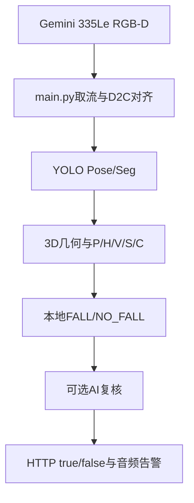

# RGB-D Fall Detection

基于 Orbbec Gemini 335Le RGB-D 深度相机的跌倒检测系统。系统使用 YOLO Pose 获取人体关键点，使用 YOLO Seg 识别床、沙发和椅子，结合深度数据计算人体三维几何，并通过本地五维评分、可选豆包视觉 AI 复核和 HTTP 接口输出最终结果。

当前运行代码标记为 **v0.96**。本次 README 和 `V0.97_CHANGELOG.txt` 用于整理下一版的部署与环境管理方案；完成 ONNX 实机验证后，再同步 `VERSION` 和 `pyproject.toml` 的版本号。

## 1. 系统能力

- RGB-D 深度相机取流和 RGB/Depth 对齐。
- YOLO Pose 人体检测、关键点提取和跟踪 ID。
- YOLO Seg 家具实例分割。
- 3D 姿态角度、2D 姿态角度、人框比例。
- 髋部高度变化、下降速度和异常后静止时间。
- 人与地面、床、沙发、椅子的场景关系。
- P/H/V/S/C 五维本地评分和 `FALL/NO_FALL` 二值状态机。
- 深度质量异常、2D/3D姿态冲突和地面质量保护。
- 满足本地确认或强疑似触发条件时，可选上传一张图片给豆包视觉模型复核。
- AI 失败或断网时继续使用本地结果。
- HTTP POST 发送最终 `true/false`，HTTP `/reset` 接收外部重置命令。
- 日志、告警音频和 AI 调试图片均可通过 `config.yaml` 配置。

## 2. 数据流



本地检测是主链路。AI 只在配置的本地高风险或确认条件满足时异步上传单张图片，不阻塞相机主循环。`ground_detector.py` 是初始地面标定工具；在线 `ground_manager` 会继续评估地面质量，但相机安装位置发生明显变化后仍建议重新标定。

## 3. 目录结构

```text
hxb_code/
└── fall_detection/
    ├── assets/                         # 模型、标定和离线图片等外部资源
    │   ├── models/                     # .pt或.onnx模型
    │   ├── calibration/                # ground.yaml
    │   └── images/                     # 离线测试图片，可为空
    ├── audio/                          # FALL和恢复提示音
    ├── deploy/                         # 安装报告、锁定版本和部署记录
    ├── docs/                           # 架构、开发、AI和Ubuntu部署文档
    ├── Log/                            # 运行日志，程序自动创建
    ├── python_packages/                # 项目自己的第三方Python包
    │   ├── v1/                         # 已验证的一套依赖
    │   └── v2/                         # 升级或ONNX验证中的新依赖
    ├── tests/                          # unittest/pytest入口
    ├── fall_detection/                 # Python源码包
    │   ├── app/                        # 主流程和命令行入口
    │   ├── domain/                     # 跌倒状态机和分数融合
    │   ├── features/                   # 高度、速度和静止等时序特征
    │   ├── infrastructure/             # 日志、音频等运行基础设施
    │   ├── integrations/               # AI、HTTP、告警等外部接口
    │   ├── perception/                 # 姿态、场景、地面和测量保护
    │   └── tools/                      # 标定、内参、模型和单图测试工具
    ├── .gitignore                      # 忽略密钥、日志、模型和运行缓存
    ├── config.yaml                     # 所有在线可调参数
    ├── fall_local_python.py            # 项目本地依赖启动器
    ├── install_fall_local.sh           # 创建一套新的本地依赖
    ├── main.py                         # 兼容启动入口
    ├── pyproject.toml                  # Python包元数据
    ├── requirements.fall-local.txt     # 本项目依赖需求
    ├── VERSION                         # 当前代码版本
    └── README.md                       # 本文件
```

源码包内的目录只放 Python 代码。模型、音频、标定文件、日志和图片不要复制进 `fall_detection/app`、`domain`、`features`、`perception` 或 `integrations`。

## 4. 主要文件职责

| 路径 | 职责 |
| --- | --- |
| `main.py` | 保留根目录启动方式，并调用 `fall_detection.app.main` |
| `fall_detection/app/main.py` | 相机、模型、模块编排、窗口显示和完整流程 |
| `fall_detection/domain/fall_detector.py` | 五项分数加权和 FALL/NO_FALL 状态机 |
| `fall_detection/domain/decision_fusion.py` | 本地结果和 AI 结果融合 |
| `fall_detection/features/height.py` | 髋部下降量和绝对高度评分 |
| `fall_detection/features/velocity.py` | 髋部向下速度评分 |
| `fall_detection/features/static.py` | 异常姿态后持续静止评分 |
| `fall_detection/perception/pose_2d.py` | RGB画面二维角度和人框比例 |
| `fall_detection/perception/pose_3d.py` | 3D人体轴线与地面法向量夹角 |
| `fall_detection/perception/scene.py` | 人与家具、地面的关系 |
| `fall_detection/perception/ground_manager.py` | 在线地面质量评估和候选平面更新 |
| `fall_detection/perception/measurement_guard.py` | 深度跳变、几何异常和2D/3D冲突保护 |
| `fall_detection/integrations/ai_verifier.py` | 单图视觉 AI 请求、超时和断网回退 |
| `fall_detection/integrations/http_bridge.py` | 发送最终结果和接收 `/reset` |
| `fall_detection/integrations/alert_manager.py` | FALL/NO_FALL状态变化告警 |
| `fall_detection/infrastructure/audio_alert.py` | 播放跌倒和恢复提示音 |
| `fall_detection/infrastructure/logging_utils.py` | 终端、文件日志和轮转 |
| `fall_detection/tools/ground_detector.py` | 初始地面标定并生成 `ground.yaml` |
| `fall_detection/tools/get_intrinsics.py` | 查看当前相机内参 |
| `fall_detection/tools/export_onnx.py` | 将支持的 YOLO `.pt` 模型导出为 `.onnx` |
| `fall_detection/tools/ai_test.py` | 用一张图片单独测试 AI |
| `tests/test_smoke.py` | 标准测试入口 |

## 5. 配置和外部资源

所有在线阈值放在根目录 `config.yaml`。常用路径如下：

| 配置项 | 作用 |
| --- | --- |
| `paths.ground_file` | 地面标定文件，当前为 `assets/calibration/ground.yaml` |
| `models.pose_model` | 人体 Pose 模型 |
| `models.scene_model` | 家具 Seg 模型 |
| `runtime.device` | `auto`、`cpu` 或 GPU编号 |
| `runtime.use_half` | 只建议在 CUDA + `.pt` 模型时启用 |
| `display.enabled` | 是否显示 OpenCV 窗口 |
| `display.show_debug_text` | 是否在人体框下显示详细参数 |
| `ai.enabled` | 是否启用 AI 复核 |
| `ai.api_key_env` | API Key 所在环境变量名，通常为 `ARK_API_KEY` |
| `http_bridge.target_url` | 最终 `true/false` 的接收地址 |
| `audio.fall_file` | FALL时播放的音频 |
| `audio.recovery_file` | 恢复为 NO_FALL 时播放的音频 |

API Key 建议使用环境变量，不要写入代码、配置文件或 Git：

```bash
export ARK_API_KEY="你的API密钥"
```

如果使用 ONNX 模型，`models.pose_model` 和 `models.scene_model` 必须指向对应的 `.onnx` 文件，并且项目依赖中必须包含 CPU 运行库：

```text
onnxruntime==1.23.2
```

安装 ONNX 运行库后要创建新的本地依赖目录，例如 `v2`，不要把新旧依赖混装到已经验证的 `v1`。

## 6. Ubuntu 22.04 本地依赖部署

本项目不创建虚拟环境或 Conda 环境。它使用系统 `/usr/bin/python3`，再通过 `python_packages/vN` 限制第三方包搜索路径。这样可以让 fall 项目使用自己的 NumPy、OpenCV、PyTorch和相机SDK，不升级其他项目的共享包。

前提是系统已经安装 Python 3.10、pip、Orbbec SDK所需的系统库和相机 udev 规则：

```bash
cd ~/hxb_code/fall_detection
python3 --version
uname -m
```

在 Ubuntu 22.04 x86_64 上创建一套新依赖：

```bash
cd ~/hxb_code/fall_detection
# 首次安装使用v1；如果当前配置使用ONNX且v1没有onnxruntime，使用v2。
bash install_fall_local.sh v1
```

如果 `python_packages/v1` 已存在，安装脚本会拒绝覆盖。需要升级时修改 `requirements.fall-local.txt` 后使用新的目录名：

```bash
bash install_fall_local.sh v2
```

安装完成后检查实际导入路径：

```bash
/usr/bin/python3 -I -S fall_local_python.py --deps v1 --check
/usr/bin/python3 -I -S fall_local_python.py --deps v1 -m pip check
```

检查输出中的每个包都应位于：

```text
.../fall_detection/python_packages/v1/
```

不要只看 `pip list`。本项目需要确认运行时实际导入的文件没有来自 `/usr/local/lib`、用户目录或 ROS 的共享 site-packages。

推荐把已验收的完整版本保存到 `deploy`：

```bash
/usr/bin/python3 -I -S fall_local_python.py --deps v1 -m pip freeze \
  --all --path "$PWD/python_packages/v1" \
  > deploy/requirements.fall-v1.lock.txt
```

安装报告由安装脚本保存为 `deploy/install-v1.json` 或 `deploy/install-v2.json`。

## 7. 各模块独立启动和自测试

### 7.1 运行前先选好依赖目录

下面的运行示例统一使用 `python_packages/v2`。请先确认这个目录已经安装完整，并且能够通过导入检查。
如果你实际使用的是 `v1`，把命令中的 `--deps v2` 换成 `--deps v1`；配置使用ONNX时，选中的目录需要包含 `onnxruntime`。

```bash
# 进入包含config.yaml和fall_local_python.py的项目根目录。
cd ~/hxb_code/fall_detection

# 查看本次使用的解释器、依赖目录和Python搜索路径。
/usr/bin/python3 -I -S fall_local_python.py --deps v2 --info

# 检查关键库的真实导入位置和基础二进制功能。
/usr/bin/python3 -I -S fall_local_python.py --deps v2 --check

# 检查选中目录内的包依赖关系。
/usr/bin/python3 -I -S fall_local_python.py --deps v2 -m pip check
```

下面采用 `-m fall_detection.包名.模块名` 启动模块，使包内相对导入能够正确工作。
Linux区分大小写，当前文件名为 `pose_2d.py`、`pose_3d.py`，命令中也使用小写。

命令参数的先后顺序：

| 参数 | 由谁读取 | 用途 |
| --- | --- | --- |
| `-I -S` | 系统Python | 限制共享Python包和外部路径对当前进程的影响 |
| `--deps v2` | `fall_local_python.py` | 选择本项目的依赖目录，应放在目标脚本或 `-m` 之前 |
| `-m fall_detection.…` | 本地启动器 | 按完整包名执行模块 |
| `--self-test` | 支持此参数的目标模块 | 运行合成数据测试 |
| `--config config.yaml` | 支持此参数的目标模块 | 指定运行配置，应放在模块名之后 |
| `--stage pose_2d` | `main.py` | 选择主流程中的功能测试阶段 |

代码块中的相机命令应逐条选择运行。退出上一个窗口并释放相机后，再启动下一个模块。
OpenCV窗口需要桌面显示环境；只通过普通SSH终端连接时，可以先运行无相机自测试。
`display.enabled: true` 控制窗口，`display.show_debug_text: true` 控制窗口中的白色详细参数。

### 7.2 完整流程与统一阶段入口

```bash
# 完整相机流程：本地检测、可选AI复核、融合、HTTP和音频。
/usr/bin/python3 -I -S fall_local_python.py --deps v2 main.py

# 完整流程的包入口；与上一条任选其一。
/usr/bin/python3 -I -S fall_local_python.py --deps v2 -m fall_detection.app.main

# 通过主程序打开一个功能阶段，例如二维姿态。
/usr/bin/python3 -I -S fall_local_python.py --deps v2 main.py --stage pose_2d

# 指定配置文件时，把配置参数放到目标脚本后面。
/usr/bin/python3 -I -S fall_local_python.py --deps v2 main.py --config config.yaml
```

`main.py --stage` 的可选值：

| 值 | 主要观察内容 |
| --- | --- |
| `pose_3d` | 三维姿态角度和P3D |
| `pose_2d` | 二维姿态角度、人框比例和P2D |
| `height` | 高度分H、基准髋高、下降量 |
| `velocity` | 速度分V、髋部垂直速度 |
| `static` | 静止分S、躯干速度、持续静止时间 |
| `scene` | 家具Mask、人物场景关系和场景分C |
| `fall_detector` | 本地五维评分和FALL/NO_FALL状态机 |
| `ai` | 本地检测与AI复核、最终融合 |
| `full` | 完整流程，默认值 |

没有 `--stage ground_manager`、`--stage measurement_guard`、`--stage http` 或 `--stage audio`。
对应功能的验证方法见下文。

### 7.3 姿态、高度、速度、静止和场景：独立相机窗口

这些模块默认调用同一个 `run_live()` 采集流程，选择自己的测试阶段。
它们仍会加载该阶段所需的模型和基础测量；例如静止分需要姿态、高度和躯干中心作为输入。

```bash
# 三维姿态：人体3D轴线与地面法向量的角度，显示P3D。
/usr/bin/python3 -I -S fall_local_python.py --deps v2 -m fall_detection.perception.pose_3d

# 二维姿态：肩到髋连线与画面x轴的角度、人框比例，显示P2D。
/usr/bin/python3 -I -S fall_local_python.py --deps v2 -m fall_detection.perception.pose_2d

# 高度维度：显示髋高、历史基准、下降量和H。
/usr/bin/python3 -I -S fall_local_python.py --deps v2 -m fall_detection.features.height

# 速度维度：显示髋部垂直速度、向下速度风险V。
/usr/bin/python3 -I -S fall_local_python.py --deps v2 -m fall_detection.features.velocity

# 静止维度：显示异常候选后的躯干速度、静止时间和S。
/usr/bin/python3 -I -S fall_local_python.py --deps v2 -m fall_detection.features.static

# 场景维度：显示床、沙发、椅子Mask及人与场景的关系C。
/usr/bin/python3 -I -S fall_local_python.py --deps v2 -m fall_detection.perception.scene

# 本地状态机：显示P/H/V/S/C和本地FALL/NO_FALL。
/usr/bin/python3 -I -S fall_local_python.py --deps v2 -m fall_detection.domain.fall_detector
```

本地 `fall_detector` 阶段用于检查本地判断。需要验证AI融合后的HTTP结果和音频时，使用 `ai` 或 `full` 阶段。

### 7.4 地面管理、测量保护、AI和融合：在线入口

```bash
# 在线地面管理：当前实现会打开full窗口，在完整流程中观察ground_quality。
/usr/bin/python3 -I -S fall_local_python.py --deps v2 -m fall_detection.perception.ground_manager

# 测量保护：当前实现会打开full窗口，观察2D/3D冲突和无效测量原因。
/usr/bin/python3 -I -S fall_local_python.py --deps v2 -m fall_detection.perception.measurement_guard

# AI复核：打开ai阶段窗口，满足触发条件时才提交图片。
/usr/bin/python3 -I -S fall_local_python.py --deps v2 -m fall_detection.integrations.ai_verifier

# 决策融合：打开ai阶段窗口，观察本地结果与AI结果如何形成最终状态。
/usr/bin/python3 -I -S fall_local_python.py --deps v2 -m fall_detection.domain.decision_fusion
```

`ground_manager` 和 `measurement_guard` 没有专用的纯地面或纯保护在线窗口，默认运行的是 `full`。
因此这些入口可能按配置启用AI、HTTP和音频；只想检查算法本身时，使用下一节的 `--self-test`。
初始地面标定使用 `tools.ground_detector`，与在线地面管理是两个入口。

### 7.5 各算法模块：无相机自测试

以下命令使用合成数据，不打开相机。AI自测试使用模拟请求，不会上传真实图片。
测试仍需要安装相应Python依赖，并能读取当前 `config.yaml`。
可调整阈值会影响部分自测试断言，报错时先确认所用配置。

```bash
# 测试3D姿态角度、风险子分和缺失关键点处理。
/usr/bin/python3 -I -S fall_local_python.py --deps v2 \
  -m fall_detection.perception.pose_3d --self-test

# 测试2D角度、人框比例和姿态分融合。
/usr/bin/python3 -I -S fall_local_python.py --deps v2 \
  -m fall_detection.perception.pose_2d --self-test

# 测试高度评分、跳变保护和地面可信度相关处理。
/usr/bin/python3 -I -S fall_local_python.py --deps v2 \
  -m fall_detection.features.height --self-test

# 测试下降速度、缺失高度和历史滤波保护。
/usr/bin/python3 -I -S fall_local_python.py --deps v2 \
  -m fall_detection.features.velocity --self-test

# 测试异常后静止计时及移动时清除计时。
/usr/bin/python3 -I -S fall_local_python.py --deps v2 \
  -m fall_detection.features.static --self-test

# 测试家具Mask与深度几何、人物关系和场景评分。
/usr/bin/python3 -I -S fall_local_python.py --deps v2 \
  -m fall_detection.perception.scene --self-test

# 测试在线地面质量、稳定候选确认和重新估计。
/usr/bin/python3 -I -S fall_local_python.py --deps v2 \
  -m fall_detection.perception.ground_manager --self-test

# 测试人体几何和2D/3D一致性保护。
/usr/bin/python3 -I -S fall_local_python.py --deps v2 \
  -m fall_detection.perception.measurement_guard --self-test

# 测试本地状态机、瞬态证据和缺失3D时的处理。
/usr/bin/python3 -I -S fall_local_python.py --deps v2 \
  -m fall_detection.domain.fall_detector --self-test

# 测试AI触发、异步请求和失败回退；不访问真实API。
/usr/bin/python3 -I -S fall_local_python.py --deps v2 \
  -m fall_detection.integrations.ai_verifier --self-test

# 测试AI优先、本地回退和最终状态保持。
/usr/bin/python3 -I -S fall_local_python.py --deps v2 \
  -m fall_detection.domain.decision_fusion --self-test

# 测试告警状态变化和重复事件抑制；不会验证真实HTTP或扬声器。
/usr/bin/python3 -I -S fall_local_python.py --deps v2 \
  -m fall_detection.integrations.alert_manager --self-test
```

`alert_manager` 当前默认入口也只执行合成测试，不带参数不会打开相机。

```bash
# 依次执行各模块合成测试及主流程接口测试。
/usr/bin/python3 -I -S fall_local_python.py --deps v2 main.py --self-test

# 标准unittest入口；当前test_smoke.py会调用同一组集成自测试，二者任选其一。
/usr/bin/python3 -I -S fall_local_python.py --deps v2 -m unittest discover -s tests -v
```

### 7.6 相机内参与初始地面标定

执行前先关闭其他占用相机的进程，包括完整检测流程和相机ROS驱动。

```bash
# 打开相机并在终端打印帧格式、RGB/Depth内参和外参；不显示OpenCV窗口。
/usr/bin/python3 -I -S fall_local_python.py --deps v2 -m fall_detection.tools.get_intrinsics

# 打开相机拟合地面，保存标定结果并显示地面可视化。
/usr/bin/python3 -I -S fall_local_python.py --deps v2 -m fall_detection.tools.ground_detector
```

这两个工具当前没有 `--self-test` 或 `--config` 参数。
`ground_detector` 的输出由文件内的 `GROUND_FILE` 决定，目前是
`assets/calibration/ground.yaml`；拟合成功会写入该文件，主流程再通过 `paths.ground_file` 读取。

### 7.7 用一张图片单独测试真实AI

准备实际存在的图片，例如 `assets/images/test.jpg`，并配置可用的视觉模型、API Key和超时。
下面两种方法都会上传一张真实图片，不打开相机，可以任选其一。

```bash
# 使用线上复核模块自身的API测试入口。
/usr/bin/python3 -I -S fall_local_python.py --deps v2 \
  -m fall_detection.integrations.ai_verifier --api-test assets/images/test.jpg

# 使用独立单图测试工具。
/usr/bin/python3 -I -S fall_local_python.py --deps v2 \
  -m fall_detection.tools.ai_test assets/images/test.jpg
```

`ai_verifier --api-test` 后必须提供图片参数。
API测试会直接发送图片，用来检查请求链路；相机AI模式则需要满足本地触发条件。
单图测试不会验证完整流程的自动触发、融合和HTTP发送。

### 7.8 HTTP结果接收与重置联调

`integrations/http_bridge.py` 当前没有独立 `main()` 或 `--self-test`，
它由主程序创建。接收示例工具 `tools/receiver.py` 可以独立运行。

终端A：

```bash
# 启动示例接收程序，监听127.0.0.1:8080/fall；不占用相机。
cd ~/hxb_code/fall_detection
/usr/bin/python3 -I -S fall_local_python.py --deps v2 -m fall_detection.tools.receiver
```

终端B：

```bash
# 启动真实检测流程，产生最终状态变化后发送HTTP结果。
cd ~/hxb_code/fall_detection
/usr/bin/python3 -I -S fall_local_python.py --deps v2 main.py --stage full
```

联调前确认 `config.yaml` 中 `http_bridge.enabled: true`，并让
`http_bridge.target_url` 指向 `http://127.0.0.1:8080/fall`。
示例接收程序的地址由其文件内的 `LISTEN_HOST`、`LISTEN_PORT`、`RESET_URL` 定义，当前不读取主配置。

在终端A输入：

| 输入 | 作用 |
| --- | --- |
| `status` | 查看示例接收程序最后收到的结果 |
| `reset` | 请求检测程序重置全部人员 |
| `reset 2` | 请求重置人员ID为2的历史 |
| `quit` | 关闭示例接收程序 |

实际结果只在最终状态变化时发送，不会每帧发送，也不会因为启动成功就立即发送 `false`。
外部发来的重置由相机主线程消费队列后执行，HTTP接受请求不等于状态已经同步清除。

### 7.9 音频、日志及其余基础模块

| 模块 | 当前是否有独立运行入口 | 验证方式 |
| --- | --- | --- |
| `infrastructure/audio_alert.py` | 没有 | Ubuntu用下面的 `aplay` 检查文件和声卡；事件触发通过 `full` 验证 |
| `infrastructure/logging_utils.py` | 没有 | 主程序启动后观察终端和 `Log/fall_detection.log` |
| `integrations/http_bridge.py` | 没有 | 使用上一节的接收工具与 `full` 联调 |
| 各目录的 `__init__.py` | 没有业务入口 | 用于组成Python包，不需要单独启动 |
| `domain/decision_fusion.py` | 有 | 在线入口见7.4，自测试见7.5 |
| `integrations/alert_manager.py` | 只有合成测试入口 | 自测试见7.5，真实告警通过 `full` 验证 |

```bash
# Ubuntu播放跌倒提示音；路径按audio.fall_file的实际配置修改。
aplay "audio/Are you ok.wav"

# Ubuntu播放恢复提示音；路径按audio.recovery_file的实际配置修改。
aplay "audio/care.wav"

# 在另一个终端持续查看日志；按Ctrl+C退出查看。
tail -f Log/fall_detection.log
```

`aplay` 只验证音频文件和输出设备，不验证告警事件。
完整音频链路还需要 `audio.enabled: true`，恢复音频需要 `audio.play_recovery: true`。
Ubuntu当前音频实现依赖系统的 `aplay`；它不在Python依赖目录中。

### 7.10 ONNX导出工具

此工具不打开相机，用于生成模型文件。导出与运行现有ONNX模型需要的依赖不同：
`onnxruntime` 用于推理，导出还需要匹配当前Ultralytics版本的 `onnx` 及简化工具等依赖。
启动器关闭了YOLO自动补装，缺少导出依赖时应先更新本项目的依赖清单。

当前 `fall_detection/tools/export_onnx.py` 的入口写的是根目录下的
`yolo26s-pose.pt` 和 `yolo26s-seg.pt`，并不读取 `models.pose_model`。
如果模型位于 `assets/models`，先把文件末尾两次调用改为：

```python
# 使用项目根目录下的assets/models模型；启动器会把工作目录切到项目根目录。
if __name__ == "__main__":
    # 导出人体关键点模型，输入路径需要指向PT权重。
    export_model("assets/models/yolo26s-pose.pt")
    # 导出家具实例分割模型。
    export_model("assets/models/yolo26s-seg.pt")
```

路径和导出依赖就绪后执行：

```bash
# 导出两个模型；当前工具采用640输入、batch=1和固定输入尺寸。
/usr/bin/python3 -I -S fall_local_python.py --deps v2 -m fall_detection.tools.export_onnx
```

本工具当前没有 `--config`、`--model` 或 `--self-test` 参数。
已有可用ONNX模型时，无需每次启动前重新导出。

## 8. 地面标定和相机移动

初始标定：

```bash
/usr/bin/python3 -I -S fall_local_python.py --deps v1 \
  -m fall_detection.tools.ground_detector
```

标定时相机应保持最终安装姿态，画面下半部分尽量是空地面。更换相机、分辨率、镜头内参、安装高度或俯仰角后重新标定。

`ground_manager.enabled: true` 时，主流程会根据深度点云持续计算 `ground_quality`。候选平面需要连续稳定并通过内点比例、残差、覆盖率和相机高度检查后才会接受。地面质量不够时会保护 H 的绝对高度判断，并暂停受影响的历史更新，避免错误平面污染状态机。

## 9. AI、HTTP和音频接口

AI复核使用一张当前帧图片。图片会在内存中缩放并压缩为 JPEG Data URL，默认不保存本地图片；需要调试时才打开 `ai.debug.save_trigger_image`。AI请求失败、超时或断网时，本地检测继续运行。

最终状态变化由 `http_bridge` 后台发送：

```json
{"fall": true}
```

或者：

```json
{"fall": false}
```

另一个程序可以请求本项目重置：

```bash
curl -X POST http://127.0.0.1:8123/reset \
  -H 'Content-Type: application/json' \
  -d '{}'
```

只重置一个人员：

```bash
curl -X POST http://127.0.0.1:8123/reset \
  -H 'Content-Type: application/json' \
  -d '{"person_id": 2}'
```

HTTP线程只提交重置命令，主线程负责真正清除人员历史，避免线程并发修改检测器。

## 10. 日志和故障排查

日志默认写入 `Log/fall_detection.log`，同时输出到终端。重点查看：

```bash
tail -f Log/fall_detection.log
```

常见问题：

| 现象 | 检查方向 |
| --- | --- |
| `ModuleNotFoundError` | 使用 `fall_local_python.py` 启动，并执行 `--check` |
| `.onnx` 模型提示缺少 `onnxruntime` | 在依赖清单增加 `onnxruntime`，创建新的 `v2` |
| RGB或Depth首帧超时 | 检查相机连接、USB权限、udev规则和SDK扩展 |
| 地面质量低 | 重新标定，清理地面区域，检查Depth有效率 |
| HTTP发送失败 | 检查 `http_bridge.target_url` 对应程序是否监听 |
| AI不请求 | 查看本地触发阈值、API Key、网络和 `ai.enabled` |
| OpenCV没有窗口 | 检查 `display.enabled`、桌面会话和 `DISPLAY` |
| `half` 弃用警告 | 这是推理库警告，不等于模型加载失败；先确认实际错误堆栈 |

## 11. 清理规则

可以删除安装完成后的临时目录，例如：

```text
python_packages/build_tools.*
```

`python_packages/v1` 或 `v2` 是运行依赖，不能删除当前正在使用的目录。只有新目录完成自测试、ONNX模型加载和真实相机验收后，旧目录才适合删除。

建议保留：

- `requirements.fall-local.txt`；
- `deploy/install-vN.json`；
- `deploy/requirements.fall-vN.lock.txt`；
- 当前使用的模型、标定文件和音频；
- 出现问题时对应时间段的日志。

不要删除依赖目录中的 `*.dist-info`、动态库或看似未直接 import 的包。 `pyorbbecsdk2`、 `open3d`、 `scipy` 和它们的间接依赖可能由运行库使用。

## 12. Git提交建议

模型、API Key、日志、调试图片和本地依赖目录通常不提交到 Git。提交源代码、配置模板、安装脚本、锁文件和文档：

```bash
git add README.md V0.97_CHANGELOG.txt
git add config.yaml fall_local_python.py install_fall_local.sh
git add requirements.fall-local.txt pyproject.toml VERSION
git add fall_detection tests docs .gitignore
git commit -m "docs: update fall detection deployment guide for v0.97"
```

如果 `python_packages/v1` 或 `v2` 已被 Git 跟踪，不要直接删除后提交；先确认它是否属于交付策略。通常工程仓库保存安装清单和锁文件，依赖目录另行打包或部署。

## 13. 版本说明

- `VERSION` 和 `pyproject.toml` 表示代码包版本。
- `V0.97_CHANGELOG.txt` 表示本次准备纳入的更新记录。
- `python_packages/v1`、 `v2` 表示依赖快照版本，不等于代码版本。
- 修改检测算法后应增加代码版本；只更新部署文档或依赖快照时应在变更记录中注明范围。

适用硬件：Orbbec Gemini 335Le RGB-D。  

适用系统：Ubuntu 22.04 x86_64，Python 3.10；Windows可继续使用项目原有环境。  

当前代码版本：`v0.96.0`。  

文档更新：`v0.97` 部署准备。
