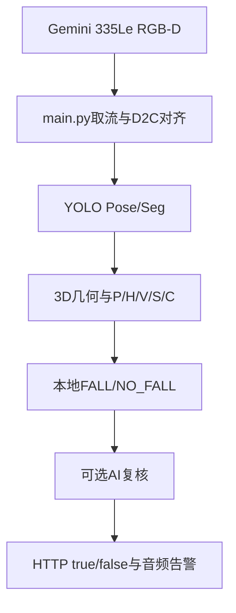

# RGB-D Fall Detection

基于 Orbbec Gemini 335Le RGB-D 深度相机的跌倒检测系统。系统使用 YOLO Pose 获取人体关键点，使用 YOLO Seg 识别床、沙发和椅子，结合深度数据计算人体三维几何，并通过本地五维评分、可选豆包视觉 AI 复核和 HTTP 接口输出最终结果。

当前运行代码标记为 **v0.96**。本次 README 和 `V0.97_CHANGELOG.txt` 用于整理下一版的部署与环境管理方案；完成 ONNX 实机验证后，再同步 `VERSION` 和 `pyproject.toml` 的版本号。

## 1. 系统能力

- RGB-D 深度相机取流和 RGB/Depth 对齐。
- YOLO Pose 人体检测、关键点提取和跟踪 ID。
- YOLO Seg 家具实例分割。
- 3D 姿态角度、2D 姿态角度、人框比例。
- 髋部高度变化、下降速度和异常后静止时间。
- 人与地面、床、沙发、椅子的场景关系。
- P/H/V/S/C 五维本地评分和 `FALL/NO_FALL` 二值状态机。
- 深度质量异常、2D/3D姿态冲突和地面质量保护。
- 本地检测确认后可选上传一张图片给豆包视觉模型复核。
- AI 失败或断网时继续使用本地结果。
- HTTP POST 发送最终 `true/false`，HTTP `/reset` 接收外部重置命令。
- 日志、告警音频和 AI 调试图片均可通过 `config.yaml` 配置。

## 2. 数据流



本地检测是主链路。AI 只在配置的本地高风险或确认条件满足时异步上传单张图片，不阻塞相机主循环。`ground_detector.py` 是初始地面标定工具；在线 `ground_manager` 会继续评估地面质量，但相机安装位置发生明显变化后仍建议重新标定。

## 3. 目录结构

```text
hxb_code/
└── fall_detection/
    ├── assets/                         # 模型、标定和离线图片等外部资源
    │   ├── models/                     # .pt或.onnx模型
    │   ├── calibration/                # ground.yaml
    │   └── images/                     # 离线测试图片，可为空
    ├── audio/                          # FALL和恢复提示音
    ├── deploy/                         # 安装报告、锁定版本和部署记录
    ├── docs/                           # 架构、开发、AI和Ubuntu部署文档
    ├── Log/                            # 运行日志，程序自动创建
    ├── python_packages/                # 项目自己的第三方Python包
    │   ├── v1/                         # 已验证的一套依赖
    │   └── v2/                         # 升级或ONNX验证中的新依赖
    ├── tests/                          # unittest/pytest入口
    ├── fall_detection/                 # Python源码包
    │   ├── app/                        # 主流程和命令行入口
    │   ├── domain/                     # 跌倒状态机和分数融合
    │   ├── features/                   # 高度、速度和静止等时序特征
    │   ├── infrastructure/             # 日志、音频等运行基础设施
    │   ├── integrations/               # AI、HTTP、告警等外部接口
    │   ├── perception/                 # 姿态、场景、地面和测量保护
    │   └── tools/                      # 标定、内参、模型和单图测试工具
    ├── .gitignore                      # 忽略密钥、日志、模型和运行缓存
    ├── config.yaml                     # 所有在线可调参数
    ├── fall_local_python.py            # 项目本地依赖启动器
    ├── install_fall_local.sh           # 创建一套新的本地依赖
    ├── main.py                         # 兼容启动入口
    ├── pyproject.toml                  # Python包元数据
    ├── requirements.fall-local.txt     # 本项目依赖需求
    ├── VERSION                         # 当前代码版本
    └── README.md                       # 本文件
```

源码包内的目录只放 Python 代码。模型、音频、标定文件、日志和图片不要复制进 `fall_detection/app`、`domain`、`features`、`perception` 或 `integrations`。

## 4. 主要文件职责

| 路径 | 职责 |
| --- | --- |
| `main.py` | 保留根目录启动方式，并调用 `fall_detection.app.main` |
| `fall_detection/app/main.py` | 相机、模型、模块编排、窗口显示和完整流程 |
| `fall_detection/domain/fall_detector.py` | 五项分数加权和 FALL/NO_FALL 状态机 |
| `fall_detection/domain/decision_fusion.py` | 本地结果和 AI 结果融合 |
| `fall_detection/features/height.py` | 髋部下降量和绝对高度评分 |
| `fall_detection/features/velocity.py` | 髋部向下速度评分 |
| `fall_detection/features/static.py` | 异常姿态后持续静止评分 |
| `fall_detection/perception/pose_2d.py` | RGB画面二维角度和人框比例 |
| `fall_detection/perception/pose_3d.py` | 3D人体轴线与地面法向量夹角 |
| `fall_detection/perception/scene.py` | 人与家具、地面的关系 |
| `fall_detection/perception/ground_manager.py` | 在线地面质量评估和候选平面更新 |
| `fall_detection/perception/measurement_guard.py` | 深度跳变、几何异常和2D/3D冲突保护 |
| `fall_detection/integrations/ai_verifier.py` | 单图视觉 AI 请求、超时和断网回退 |
| `fall_detection/integrations/http_bridge.py` | 发送最终结果和接收 `/reset` |
| `fall_detection/integrations/alert_manager.py` | FALL/NO_FALL状态变化告警 |
| `fall_detection/infrastructure/audio_alert.py` | 播放跌倒和恢复提示音 |
| `fall_detection/infrastructure/logging_utils.py` | 终端、文件日志和轮转 |
| `fall_detection/tools/ground_detector.py` | 初始地面标定并生成 `ground.yaml` |
| `fall_detection/tools/get_intrinsics.py` | 查看当前相机内参 |
| `fall_detection/tools/export_onnx.py` | 将支持的 YOLO `.pt` 模型导出为 `.onnx` |
| `fall_detection/tools/ai_test.py` | 用一张图片单独测试 AI |
| `tests/test_smoke.py` | 标准测试入口 |

## 5. 配置和外部资源

所有在线阈值放在根目录 `config.yaml`。常用路径如下：

| 配置项 | 作用 |
| --- | --- |
| `paths.ground_file` | 地面标定文件，当前为 `assets/calibration/ground.yaml` |
| `models.pose_model` | 人体 Pose 模型 |
| `models.scene_model` | 家具 Seg 模型 |
| `models.scene_inference_interval_frames` | 画面有人时的家具 Seg 推理帧间隔 |
| `models.scene_idle_interval_frames` | 画面无人时的家具 Seg 推理帧间隔 |
| `runtime.device` | `auto`、`cpu` 或 GPU编号 |
| `runtime.use_half` | 只建议在 CUDA + `.pt` 模型时启用 |
| `runtime.opencv_threads` | OpenCV辅助计算线程数，避免与ONNX线程池争抢CPU |
| `runtime.performance_log_interval_s` | 处理FPS和Seg实际频率的日志周期 |
| `ground_manager.update_interval_frames` | 在线地面RANSAC的运行帧间隔 |
| `display.enabled` | 是否显示 OpenCV 窗口 |
| `display.show_debug_text` | 是否在人体框下显示详细参数 |
| `ai.enabled` | 是否启用 AI 复核 |
| `ai.api_key_env` | API Key 所在环境变量名，通常为 `ARK_API_KEY` |
| `http_bridge.target_url` | 最终 `true/false` 的接收地址 |
| `audio.fall_file` | FALL时播放的音频 |
| `audio.recovery_file` | 恢复为 NO_FALL 时播放的音频 |

API Key 建议使用环境变量，不要写入代码、配置文件或 Git：

```bash
export ARK_API_KEY="你的API密钥"
```

如果使用 ONNX 模型，`models.pose_model` 和 `models.scene_model` 必须指向对应的 `.onnx` 文件，并且项目依赖中必须包含 CPU 运行库：

```text
onnxruntime==1.23.2
```

安装 ONNX 运行库后要创建新的本地依赖目录，例如 `v2`，不要把新旧依赖混装到已经验证的 `v1`。

当前CPU性能策略不会修改Pose模型、输入尺寸、模型置信度或跌倒评分阈值。Pose仍然每帧运行；家具Seg在有人时每6帧运行一次、无人时每30帧运行一次，人物重新进入画面时立即刷新。在线地面RANSAC每10帧运行一次，并且只在该帧创建排除Mask。主循环不再复制整帧图像，关闭`display.enabled`后还会跳过全部绘图。运行日志每5秒输出`processed_fps`、`scene_fps`以及`pose_ms`、`scene_ms`、`ground_ms`、`loop_ms`，用于实机定位CPU瓶颈。

## 6. Ubuntu 22.04 本地依赖部署

本项目不创建虚拟环境或 Conda 环境。它使用系统 `/usr/bin/python3`，再通过 `python_packages/vN` 限制第三方包搜索路径。这样可以让 fall 项目使用自己的 NumPy、OpenCV、PyTorch和相机SDK，不升级其他项目的共享包。

前提是系统已经安装 Python 3.10、pip、Orbbec SDK所需的系统库和相机 udev 规则：

```bash
cd ~/hxb_code/fall_detection
python3 --version
uname -m
```

在 Ubuntu 22.04 x86_64 上创建一套新依赖：

```bash
cd ~/hxb_code/fall_detection

# 首次安装使用v1；如果当前配置使用ONNX且v1没有onnxruntime，使用v2。
bash install_fall_local.sh v1
```

如果 `python_packages/v1` 已存在，安装脚本会拒绝覆盖。需要升级时修改 `requirements.fall-local.txt` 后使用新的目录名：

```bash
bash install_fall_local.sh v2
```

安装完成后检查实际导入路径：

```bash
/usr/bin/python3 -I -S fall_local_python.py --deps v1 --check
/usr/bin/python3 -I -S fall_local_python.py --deps v1 -m pip check
```

检查输出中的每个包都应位于：

```text
.../fall_detection/python_packages/v1/
```

不要只看 `pip list`。本项目需要确认运行时实际导入的文件没有来自 `/usr/local/lib`、用户目录或 ROS 的共享 site-packages。

推荐把已验收的完整版本保存到 `deploy`：

```bash
/usr/bin/python3 -I -S fall_local_python.py --deps v1 -m pip freeze \
  --all --path "$PWD/python_packages/v1" \
  > deploy/requirements.fall-v1.lock.txt
```

安装报告由安装脚本保存为 `deploy/install-v1.json` 或 `deploy/install-v2.json`。

## 7. 测试和启动

无相机自测试：

```bash
/usr/bin/python3 -I -S fall_local_python.py --deps v1 main.py --self-test
/usr/bin/python3 -I -S fall_local_python.py --deps v1 -m unittest discover -s tests -v
```

如果默认依赖目录已经切换为 `v2`，把命令里的 `v1` 换成 `v2`。也可以在 `fall_local_python.py` 中把 `DEFAULT_DIRECTORY` 改成最终通过实机验收的目录。

启动完整相机流程：

```bash
/usr/bin/python3 -I -S fall_local_python.py --deps v1 main.py
```

按功能阶段测试：

```bash
/usr/bin/python3 -I -S fall_local_python.py --deps v1 main.py --stage pose_3d
/usr/bin/python3 -I -S fall_local_python.py --deps v1 main.py --stage pose_2d
/usr/bin/python3 -I -S fall_local_python.py --deps v1 main.py --stage height
/usr/bin/python3 -I -S fall_local_python.py --deps v1 main.py --stage velocity
/usr/bin/python3 -I -S fall_local_python.py --deps v1 main.py --stage static
/usr/bin/python3 -I -S fall_local_python.py --deps v1 main.py --stage scene
/usr/bin/python3 -I -S fall_local_python.py --deps v1 main.py --stage fall_detector
/usr/bin/python3 -I -S fall_local_python.py --deps v1 main.py --stage full
```

`--self-test` 不打开相机，也不会向真实 AI 服务发送请求。完整相机验收才会验证模型、SDK、窗口、深度和真实地面数据。

## 8. 地面标定和相机移动

初始标定：

```bash
/usr/bin/python3 -I -S fall_local_python.py --deps v1 \
  -m fall_detection.tools.ground_detector
```

标定时相机应保持最终安装姿态，画面下半部分尽量是空地面。更换相机、分辨率、镜头内参、安装高度或俯仰角后重新标定。

`ground_manager.enabled: true` 时，主流程会根据深度点云持续计算 `ground_quality`。候选平面需要连续稳定并通过内点比例、残差、覆盖率和相机高度检查后才会接受。地面质量不够时会保护 H 的绝对高度判断，并暂停受影响的历史更新，避免错误平面污染状态机。

## 9. AI、HTTP和音频接口

AI复核使用一张当前帧图片。图片会在内存中缩放并压缩为 JPEG Data URL，默认不保存本地图片；需要调试时才打开 `ai.debug.save_trigger_image`。AI请求失败、超时或断网时，本地检测继续运行。

最终状态变化由 `http_bridge` 后台发送：

```json
{"fall": true}
```

或者：

```json
{"fall": false}
```

另一个程序可以请求本项目重置：

```bash
curl -X POST http://127.0.0.1:8123/reset \
  -H 'Content-Type: application/json' \
  -d '{}'
```

只重置一个人员：

```bash
curl -X POST http://127.0.0.1:8123/reset \
  -H 'Content-Type: application/json' \
  -d '{"person_id": 2}'
```

HTTP线程只提交重置命令，主线程负责真正清除人员历史，避免线程并发修改检测器。

## 10. 日志和故障排查

日志默认写入 `Log/fall_detection.log`，同时输出到终端。重点查看：

```bash
tail -f Log/fall_detection.log
```

常见问题：

| 现象 | 检查方向 |
| --- | --- |
| `ModuleNotFoundError` | 使用 `fall_local_python.py` 启动，并执行 `--check` |
| `.onnx` 模型提示缺少 `onnxruntime` | 在依赖清单增加 `onnxruntime`，创建新的 `v2` |
| RGB或Depth首帧超时 | 检查相机连接、USB权限、udev规则和SDK扩展 |
| 地面质量低 | 重新标定，清理地面区域，检查Depth有效率 |
| HTTP发送失败 | 检查 `http_bridge.target_url` 对应程序是否监听 |
| AI不请求 | 查看本地触发阈值、API Key、网络和 `ai.enabled` |
| OpenCV没有窗口 | 检查 `display.enabled`、桌面会话和 `DISPLAY` |
| `half` 弃用警告 | 这是推理库警告，不等于模型加载失败；先确认实际错误堆栈 |

## 11. 清理规则

可以删除安装完成后的临时目录，例如：

```text
python_packages/build_tools.*
```

`python_packages/v1` 或 `v2` 是运行依赖，不能删除当前正在使用的目录。只有新目录完成自测试、ONNX模型加载和真实相机验收后，旧目录才适合删除。

建议保留：

- `requirements.fall-local.txt`；
- `deploy/install-vN.json`；
- `deploy/requirements.fall-vN.lock.txt`；
- 当前使用的模型、标定文件和音频；
- 出现问题时对应时间段的日志。

不要删除依赖目录中的 `*.dist-info`、动态库或看似未直接 import 的包。 `pyorbbecsdk2`、 `open3d`、 `scipy` 和它们的间接依赖可能由运行库使用。

## 12. Git提交建议

模型、API Key、日志、调试图片和本地依赖目录通常不提交到 Git。提交源代码、配置模板、安装脚本、锁文件和文档：

```bash
git add README.md V0.97_CHANGELOG.txt
git add config.yaml fall_local_python.py install_fall_local.sh
git add requirements.fall-local.txt pyproject.toml VERSION
git add fall_detection tests docs .gitignore

git commit -m "docs: update fall detection deployment guide for v0.97"
```

如果 `python_packages/v1` 或 `v2` 已被 Git 跟踪，不要直接删除后提交；先确认它是否属于交付策略。通常工程仓库保存安装清单和锁文件，依赖目录另行打包或部署。

## 13. 版本说明

- `VERSION` 和 `pyproject.toml` 表示代码包版本。
- `V0.97_CHANGELOG.txt` 表示本次准备纳入的更新记录。
- `python_packages/v1`、 `v2` 表示依赖快照版本，不等于代码版本。
- 修改检测算法后应增加代码版本；只更新部署文档或依赖快照时应在变更记录中注明范围。

适用硬件：Orbbec Gemini 335Le RGB-D。  
适用系统：Ubuntu 22.04 x86_64，Python 3.10；Windows可继续使用项目原有环境。  
当前代码版本：`v0.96.0`。  
文档更新：`v0.97` 部署准备。
