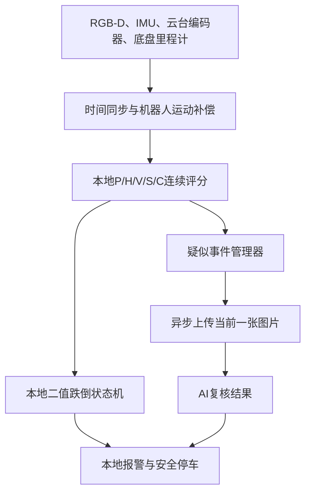

# 跌倒检测方案

> v0.95说明：本文保留了部分机器人运动补偿的后续规划。当前实际代码请以
> `FRAMEWORK.md`和`V0.95_CHANGELOG.md`为准：AI使用本地确认FALL或多证据
> 强疑似两条事件触发路径；地面由`ground_manager.py`持续验证和自动重估。

行业稳定方案：

* 本地算法始终连续运行，断网时承担完整判断。
* 底盘运动、云台转动先通过里程计、IMU和云台编码器补偿。
* 大模型只做疑似事件复核、场景理解和误报消除。
* 不每秒持续上传，而是本地FallScore达到0.50后上传当前一张图片。
* 在线且AI明确回答时短时以AI为主，AI失效后立即回到本地结果。
* 机器人运动补偿失败时，只禁用受影响的维度，不停止整个检测系统。

# 一、推荐总体架构



核心原则是：

> 大模型是增强通道，不是必需通道；机器人运动补偿是必须先解决的底层问题。

---

# 二、相机和机器人坐标关系

你的相机固定在机器人头部，头部有：

* 左右转头电机：Yaw；
* 上下抬头电机：Pitch；
* 相机固定安装在Pitch机构末端；
* 机器人底盘本身还会平移和旋转。

应该建立完整坐标链：

```text
odom
  └── base_link
        └── neck_yaw_link
              └── neck_pitch_link
                    └── camera_link
                          └── color_optical_frame
```

各坐标系的作用：

| 坐标系                   | 作用                    |
| --------------------- | --------------------- |
| `odom`                | 连续、不会突然跳变，适合计算人体速度和静止 |
| `base_link`           | 机器人底盘中心               |
| `neck_yaw_link`       | 左右转头关节                |
| `neck_pitch_link`     | 抬头低头关节                |
| `camera_link`         | 相机机械安装坐标系             |
| `color_optical_frame` | RGB和对齐Depth使用的光学坐标系   |

不要直接在相机坐标系计算人体是否移动，因为机器人一动，相机坐标系中的人体坐标就会改变。

应该把人体3D点转换到连续的 `odom` 或重力对齐坐标系：

$$
P_{odom}
=
T_{odom}^{base}
T_{base}^{yaw}
T_{yaw}^{pitch}
T_{pitch}^{camera}
P_{camera}
$$

这样，即使机器人向前走、转弯或头部转动，只要一个人站着不动，他在 `odom` 坐标系里的位置仍应基本不变。

---

# 三、IMU和两个云台电机分别负责什么

Gemini 335Le官方规格显示支持内置IMU，并且RGB、Depth、IMU可以使用统一时间戳，因此适合参与相机姿态补偿。[Orbbec Gemini 335Le官方规格](https://www.orbbec.com/gemini-335le/)

但不能只靠相机IMU。

| 数据来源       | 主要作用                | 不能单独解决的问题              |
| ---------- | ------------------- | ---------------------- |
| 云台Yaw编码器   | 获得相机左右转头的实际角度       | 不能检测底盘倾斜和机械安装误差        |
| 云台Pitch编码器 | 获得相机抬头低头的实际角度       | 不能检测机械松动、回差和底盘倾斜       |
| 相机IMU陀螺仪   | 检测相机实时角速度和快速转动      | 积分后会漂移，不能长期提供可靠绝对Yaw   |
| 相机IMU加速度计  | 估计重力方向，修正Roll/Pitch | 机器人加速、刹车时会混入运动加速度      |
| 底盘IMU      | 判断底盘倾斜和转动           | 无法单独确定平移距离             |
| 轮式里程计      | 计算底盘平移和Yaw变化        | 会随打滑产生累计误差             |
| SLAM/定位    | 提供全局位置修正            | 位姿可能突然跳变，不适合直接计算人体瞬时速度 |

## 推荐组合

* 云台角度：以电机实际编码器反馈为主，不能使用控制命令角度代替。
* 底盘短时运动：轮式里程计＋底盘IMU融合。
* 相机Roll/Pitch校验：使用335Le内置IMU。
* 全局位置：SLAM只用于定位，不直接用于人体速度差分。
* 人体速度：优先在连续的 `odom` 坐标系计算，不要在可能跳变的 `map` 坐标系计算。

如果没有底盘IMU，可以用“相机IMU＋云台编码器”反推底盘Roll/Pitch，但稳定性不如单独安装底盘IMU。

---

# 四、地面平面应该怎么处理

相机固定在云台上之后，每次转头不需要人工重新运行 `ground_detector.py`。

正确做法是：

1. `ground_detector.py`完成首次地面标定。
2. 将地面平面保存到机器人稳定坐标系，例如`odom_ground`或`base_ground`。
3. 根据底盘位姿和云台实际角度，实时把地面平面转换到当前相机坐标系。
4. 使用Depth定期验证地面平面是否仍然正确。
5. 如果机械回差、底盘倾斜或地面坡度使平面发生变化，再进行在线小幅修正。

Depth在线验证可以从没有人体和家具的地面区域提取点云，通过RANSAC拟合地面。PCL官方提供了标准的RANSAC平面分割方法。[PCL平面分割说明](https://pointclouds.org/documentation/tutorials/planar_segmentation.html)

在线地面平面必须满足：

* 法向量接近IMU测得的重力方向；
* 地面内点数量足够；
* 相机离地高度合理；
* 与上一帧平面变化不能过大；
* 拟合区域排除人体框和家具Mask；
* 连续多次拟合一致才更新。

因此，云台编码器负责“预测地面在哪里”，Depth拟合负责“检查和修正预测结果”。

---

# 五、移动过程中五维数据怎么判断

机器人移动不代表本地五维失效。只要完成运动补偿，P/H/V/S/C仍然可以继续工作。

| 维度    | 移动机器人上的正确计算方法              | 补偿失败时怎么处理            |
| ----- | -------------------------- | -------------------- |
| P姿态   | 3D人体轴线与重力/地面法向量夹角；2D姿态作为辅助 | P3D无效时使用P2D，降低质量     |
| H高度   | 在重力对齐坐标系计算髋部到地面距离          | 地面或Depth无效时H标记无效     |
| V下降速度 | 计算补偿后髋部离地高度的变化速度           | 补偿无效时V不参与评分          |
| S静止   | 计算人体躯干在`odom`坐标系中的运动速度     | 补偿无效时S不参与评分          |
| C场景   | Seg Mask＋Depth＋人物与家具关系     | 3D不足时退化为2D场景关系并降低可信度 |

关键变化是：

> 静止维度S判断的是“人体相对世界是否静止”，不是“人体在相机画面里是否静止”。

例如机器人向前移动，一个躺在地上的人会在画面中快速移动，但转换到 `odom` 后，他的位置基本不变，因此S应该继续增加。

同样，V应该使用：

$$
V_h=\frac{hipHeight_t-hipHeight_{t-\Delta t}}{\Delta t}
$$

因为髋高是相对地面的高度，所以正常底盘水平移动不应该产生明显的向下速度。

---

# 六、不要按静止/移动直接切权重

你的原始思路是：

| 情况    |  本地 |  AI |
| ----- | --: | --: |
| 机器人静止 | 高权重 | 低权重 |
| 机器人移动 | 低权重 | 高权重 |

这个方法不够稳定，主要有三个原因：

1. 机器人移动不代表本地数据一定不准，运动补偿正确时本地数据仍然可靠。
2. 机器人移动时上传的图像也可能模糊，大模型不一定更可靠。
3. 大模型给出的“置信度”通常不能直接当作严格概率使用。

更好的办法是给每个维度计算独立质量：

$$
w_i^\prime=w_i\times q_i
$$

$$
LocalScore=
\frac{\sum w_i^\prime Score_i}
{\sum w_i^\prime}
$$

其中：

* \(w_i\)：P/H/V/S/C的基础权重；
* \(q_i\)：当前维度的数据质量；
* 无效维度的 \(q_i=0\)，直接从评分中移除。

建议质量因素：

| 维度 | 质量依据                        |
| -- | --------------------------- |
| P  | 关键点置信度、遮挡、人体框大小、P2D/P3D是否一致 |
| H  | 髋部Depth、地面平面置信度、左右髋是否完整     |
| V  | 髋高历史、时间间隔、TF时间误差、运动补偿质量     |
| S  | 躯干3D点、机器人位姿质量、Track ID连续性   |
| C  | Seg置信度、Mask面积、家具Depth、关系置信度 |

机器人运动只应该影响这些质量值，不应该直接把本地整体权重设低。

---

# 七、机器人运动状态分级

建议内部维护运行模式，但最终业务输出仍然可以只有 `FALL/NO_FALL`。

| 内部运行模式               | 条件                 | 本地判断                | AI             |
| -------------------- | ------------------ | ------------------- | -------------- |
| `NORMAL`             | 底盘和头部运动较小，全部数据正常   | 完整P/H/V/S/C         | 只在疑似事件时调用      |
| `MOVING_COMPENSATED` | 机器人或云台运动，但运动补偿有效   | 完整P/H/V/S/C，按质量调整   | 疑似事件时调用        |
| `MOTION_UNCERTAIN`   | 里程计、编码器、IMU或时间同步异常 | 禁用受影响的V/S，保留可靠P/H/C | 在线时优先复核        |
| `OFFLINE`            | 无网络但运动补偿正常         | 完整本地判断              | 跳过AI           |
| `OFFLINE_DEGRADED`   | 无网络且运动补偿失败         | 只用可靠维度重新归一化         | 跳过AI，使用更严格持续时间 |
| `HEAD_MOVING_FAST`   | 云台快速转动或图像严重模糊      | 降低图像相关质量，暂不使用错误V/S  | 等稳定画面后再上传      |

内部模式只是算法运行条件，不需要显示成多种跌倒状态。

---

# 八、大模型不应该每秒一直上传

不建议固定每秒上传一张，原因是：

* 大量正常画面浪费网络和费用；
* 相邻图片高度重复；
* 一张静态图片很难区分“正在跌倒”和“正常躺下”；
* 网络延迟可能阻塞主检测；
* 连续上传涉及隐私和存储问题。

当前实现使用“本地0.50事件触发＋单图异步复核”。这是为了降低请求大小和响应延迟；代价是单张图只能确认当前是否倒卧在地，不能完整观察跌落过程。

## 当前单图实现

本地只保存各维度必要的数值历史，不为AI持续编码或缓存图片。达到触发阈值时才处理当前RGB帧，因此正常画面没有额外JPEG编码、内存缓存和上传开销。

## 什么时候调用大模型

| 本地情况                          | 动作                     |
| ----------------------------- | ---------------------- |
| `LocalScore < 0.50` | 不编码图片、不调用AI |
| `LocalScore ≥ 0.50` | 立即上传当前一张压缩RGB图给AI复核 |
| 同一人持续高风险 | 普通疑似至少间隔5秒再次请求 |
| 已确认FALL | 至少间隔10秒再次请求 |
| AI调用失败或断网 | 跳过AI，继续输出本地判断 |

阈值是建议起点，最后要通过真实测试数据校准。

---

# 九、一次AI请求应该上传什么

当前低延迟版本只上传触发时刻的一张图。默认使用未绘制调试文字的完整画面、最长边768像素、JPEG质量75，让AI同时看见人体、地面和家具；Responses API输入中严格只有一个`input_image`。若以后真实数据证明单图误判率不能接受，再升级为多帧事件复核。

AI只允许返回：

```text
true       明显有人跌倒或异常倒卧在地面
false      没有跌倒，或正常位于床、沙发、椅子等家具上
uncertain  遮挡、模糊或单图证据不足
```

每次请求仍带有唯一`event_id`保存在本地结果中，过期回答不能影响新事件。

---

# 十、AI与本地结果怎么融合

不建议把AI简单作为第六个分数：

```text
FinalScore = 本地×0.4 + AI×0.6
```

当前按需求采用明确AI回答短时优先，而不是把AI当成第六个加权分数。

| AI状态 | 最终处理 |
|---|---|
| 明确`true` | AI优先输出FALL，默认保持15秒 |
| 明确`false` | AI优先输出NO_FALL，默认保持3秒 |
| `uncertain`或格式错误 | 使用本地状态机 |
| 超时、断网、模型未开通、没有密钥 | 使用本地状态机 |
| AI结果过期 | 使用当前本地状态机结果 |

如果正式部署更重视避免漏报，可把`ai.fusion.ai_can_clear_local_fall`设为`false`，禁止AI的单帧`false`解除本地已经确认的FALL。

---

# 十一、疑似跌倒时让机器人主动获取更好证据

机器人最大的优势是可以主动调整自身状态。

检测到中等以上疑似事件后，建议：

1. 底盘安全减速或停止；
2. 停止云台快速扫描；
3. 云台继续跟踪疑似人员；
4. 等待约0.5～1秒获得稳定清晰画面；
5. 本地重新计算P/H/V/S/C；
6. 上传当前稳定的一张图片给AI；
7. 播放语音：“您还好吗？”
8. 结合人员回答、姿态恢复和AI结果决定是否报警。

这比“机器人高速运动时提高AI权重”更稳定，因为运动时本地和AI图像可能同时变差。

如果机器人当前不能安全停车，例如正在过门槛或避障，应先完成底盘安全控制，再执行观察。

---

# 十二、断网情况下怎么判断

断网时AI应直接变为“无效”，不能按AI=0分处理。

## 运动补偿正常

继续使用：

```text
P + H + V + S + C
```

本地功能不受影响。

## 运动补偿部分失效

例如底盘里程计异常，但地面和3D角度仍正常：

```text
P + H + C
```

V和S标记无效，剩余权重重新归一化。

## Depth和运动补偿全部失效

使用：

```text
P2D + 2D场景关系
```

但必须使用更严格条件，例如：

* P2D至少0.85；
* 持续2～3秒；
* Track ID稳定；
* 图像清晰；
* 人体没有严重遮挡；
* 可以配合语音询问；
* 不允许一次横向人体框直接触发正式报警。

所以不是“断网移动时完全不判断”，而是降低可用维度并提高确认要求。

---

# 十三、时间同步非常重要

必须使用同一个时间点的数据：

```text
RGB时间戳
Depth时间戳
相机IMU时间戳
云台Yaw/Pitch编码器时间戳
底盘里程计时间戳
底盘IMU时间戳
```

例如RGB帧时间是 `t`，必须取得或插值得到时刻 `t` 的：

* 底盘位姿；
* Yaw电机实际角度；
* Pitch电机实际角度；
* IMU姿态。

不能直接使用“现在最新的云台角度”处理几十毫秒前拍摄的图片，否则云台快速转动时会产生明显3D误差。

建议：

* 所有数据使用单调时间或ROS统一时间；
* 保存消息时间戳；
* 对里程计和关节角进行插值；
* TF数据过旧时，将V/S标记无效；
* 不允许拿未来或过期位姿强行补偿。

---

# 十四、需要完成的标定

要实现稳定运动检测，需要完成以下一次性标定：

| 标定内容           | 目的                  |
| -------------- | ------------------- |
| RGB与Depth内外参   | 保证D2C和3D反投影准确       |
| 相机到Pitch末端外参   | 确定相机相对云台的固定位置和方向    |
| Yaw电机零位        | 消除左右转头零点误差          |
| Pitch电机零位      | 消除抬头低头零点误差          |
| Yaw/Pitch实际旋转轴 | 处理装配轴不完全理想的问题       |
| 云台连杆长度         | 补偿Pitch转动引起的相机位置变化  |
| IMU到相机坐标系外参    | 将重力和角速度转换到相机/机器人坐标系 |
| 相机与底盘时间偏移      | 避免机器人运动时产生假人体速度     |
| 初始地面平面         | 建立高度和3D角度参考         |

电机必须读取实际编码器反馈，不能只使用目标角度。机械减速器回差、云台松动和控制延迟都可能导致目标角度与真实角度不同。

---

# 十五、建议的最终系统分层

| 模块                     | 职责                      |
| ---------------------- | ----------------------- |
| `motion_compensation`  | 底盘、云台、IMU时间同步与人体3D点运动补偿 |
| `ground_plane_manager` | 初始平面、动态转换、Depth验证和在线修正  |
| `local_fall_detector`  | 连续计算P/H/V/S/C和本地二值状态    |
| `ai_trigger`          | 本地FallScore达到0.50时创建单图事件   |
| `ai_verifier`          | 异步上传一张图片、解析true/false返回   |
| `decision_fusion`      | 处理本地与AI的一致、冲突、超时和过期     |
| `alert_manager`        | 停车、转头、语音询问、联系人告警        |
| `network_manager`      | 在线、弱网、断网和请求队列控制         |
| `logger`               | 保存事件、状态变化、AI结果和报警原因     |

---

# 十六、推荐运行参数起点

| 项目         |          建议起点 |
| ---------- | ------------: |
| 本地人体检测     |     15～30 FPS |
| 家具Seg      |       2～5 FPS |
| AI第一次上传    |  本地分数首次达到疑似阈值 |
| AI触发阈值     |  `FallScore ≥ 0.50` |
| 单次AI图片     | 当前一张完整画面，最长边768像素 |
| AI重复请求间隔   |        至少3～5秒 |
| 已确认FALL复核  |        默认10秒一次 |
| AI请求超时     |    3～5秒后按本地继续 |
| 云台高速运动稳定等待 |       约0.5～1秒 |
| TF最大允许时间差  |  建议控制在50 ms以内 |
| ID离场历史保留   |     当前5秒可继续使用 |

---

# 十七、实施顺序

建议严格按以下顺序开发：

1. 建立完整TF树和坐标系定义。
2. 接入云台两个电机的实际编码器角度。
3. 接入底盘里程计和IMU。
4. 完成RGB-D、IMU、编码器和里程计时间同步。
5. 将人体3D关键点转换到`odom`连续坐标系。
6. 验证机器人运动时，静止人员的髋高和速度是否稳定。
7. 修改P/H/V/S/C，使其使用运动补偿后的数据。
8. 完成断网和补偿失效时的维度降级。
9. 建立本地0.50分事件触发器。
10. 接入异步AI单图复核。
11. 加入机器人停车、转头和语音询问。
12. 最后使用真实跌倒、坐下、弯腰、床上躺卧数据调整阈值。

## 必须通过的验证

让一个人原地站立不动，然后机器人执行：

* 前进和后退；
* 左右转弯；
* 云台左右扫描；
* 云台抬头低头；
* 加速和刹车；
* 同时移动底盘和云台。

补偿正确时应满足：

* `hipH`基本稳定，建议波动控制在约3 cm内；
* 静止人员的垂直速度接近0；
* `angle3D`没有随云台角度大幅改变；
* 躯干世界坐标速度接近0；
* 不出现假的H、V高分；
* 人真正跌倒时，即使机器人移动，P/H/V仍能产生连续证据。

最终推荐方案可以概括成一句话：

> 使用“底盘里程计＋底盘IMU＋云台实际编码器＋相机IMU＋时间同步”把人体数据转换到连续重力坐标系，本地P/H/V/S/C始终连续运行；本地分数达到0.50时异步上传当前一张图片，AI明确回答时短时优先，弱网或断网时立即回到本地结果。

---

# 十八、当前AI接入实现状态

本项目已经提前完成AI复核层接入，但这不代表机器人运动补偿可以省略。当前新增模块如下：

| 模块 | 当前已经实现 | 后续扩展位置 |
|---|---|---|
| `ai_verifier.py` | 0.50触发、单图Responses API、后台请求、true/false解析和失败退避 | 可扩展多帧或其他视觉提供方 |
| `decision_fusion.py` | 明确视觉AI短时优先、断网本地降级、正负结果分别保持 | 已预留语音和人工确认输入 |
| `alert_manager.py` | FALL/恢复状态变化事件、控制台处理器、异常隔离 | 注册停车、云台、语音和远程通知handler |
| `main.py` | 非阻塞调用AI、显示AI状态和最终来源 | 接入运动补偿后的世界坐标数据 |

当前`ai.model`必须填写账号已经开通、支持图片理解和Responses API的模型或`ep-...`接入点。每次调用只上传一张图片，模型只输出`true`、`false`或`uncertain`。

AI调用不是每秒固定上传，而是本地疑似事件触发。API密钥缺失、断网、超时、返回格式错误或模型不确定时，不中断本地检测，也不会把缺失AI结果当成正常或跌倒证据。
